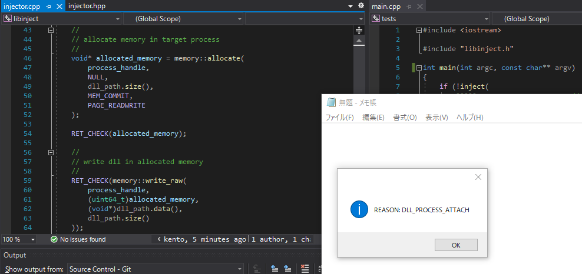
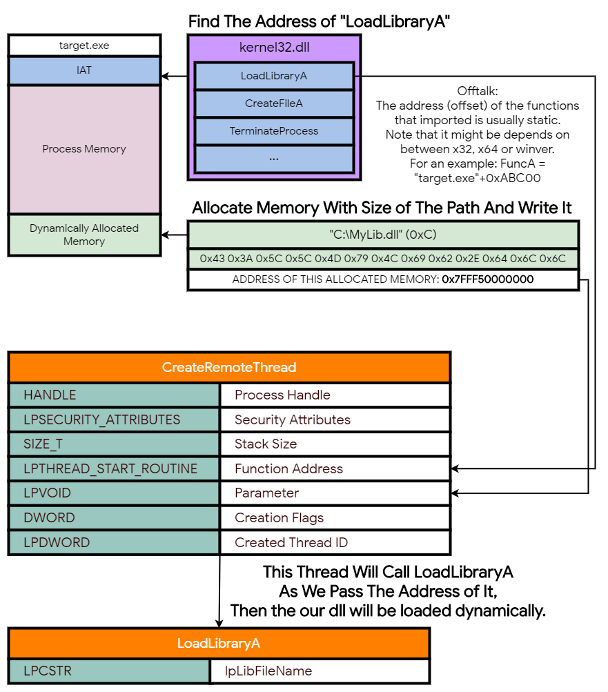

# libinject
A dll injector static library for Win x64 processes with handle elevation supported

# Overview

This library provides dll injection against any x64 processes,  
with the [handle elevation using capcom](https://github.com/notscimmy/libelevate) supported.

The handle elevation allows you to elevate our process handle obtained by `OpenProcess`.  
it means that we can call whatsoever winapis that need a process handle with granted access,  
with highest privileage, even whether the process is protected or not.

This is very useful to debug malwares that protected somehow.
But please note that there are still a tons of vectors that detects injections.

# How does this work

The concept is quite simple as follows:

- **1.** Obtain a process handle (`OpenProcess`) with needed privileage.
- **2.** Allocate memory (`VirtualAllocEx`) in target process with size of a string of the path of dll that we want to load.
- **3.** Write a payload of the dll path in allocated memory.
- **4.** Get an address of `LoadLibraryA (kernel32.dll export)` with `GetProcAddress` in order to let the process to call it dynamically later.
- **5.** Create thread remotely in target process with `CreateRemoteThread` and pass the address of what we got in 4 and parameter of the dll path that we allocated.
- **6.** Boom. our dll is now loaded in the target process.

